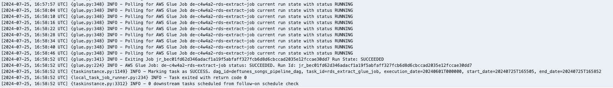
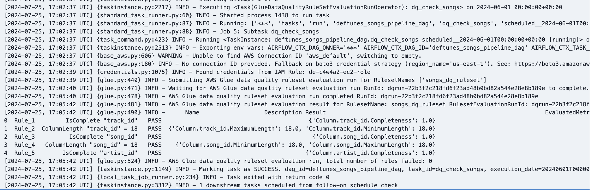
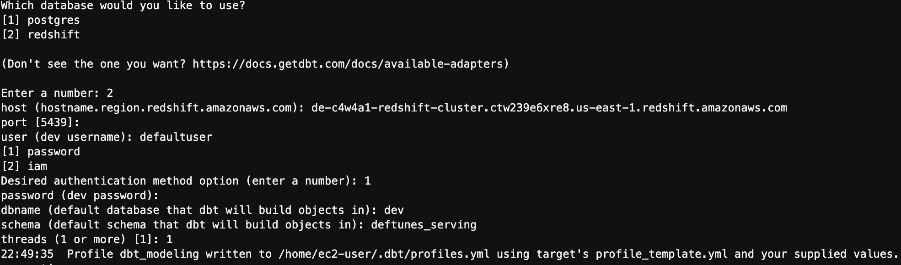
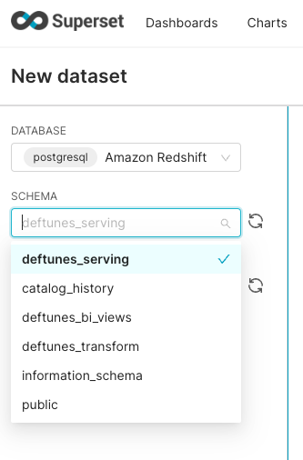

# DeFtunes Data Pipeline - Capstone Project

A comprehensive data engineering project that implements a modern data pipeline for DeFtunes, a music streaming and digital purchase platform. This project demonstrates advanced data engineering concepts including ETL pipelines, data modeling, data quality checks, and orchestration.

## 🎯 Project Overview

DeFtunes is a music streaming platform that recently expanded to include digital song purchases. This project implements a complete data pipeline to extract, transform, and load purchase data from multiple sources, enabling comprehensive analytics and insights.

## 🏗️ Architecture

The project follows a **Medallion Architecture** with three distinct zones:

### Data Flow Architecture
```
Data Sources → Landing Zone → Transformation Zone → Serving Zone
     ↓              ↓              ↓              ↓
   API/RDS    →   S3 Raw    →  Iceberg Tables → Redshift + dbt
```

### Key Components

1. **Data Sources**
   - DeFtunes API (users and sessions data)
   - DeFtunes Operational RDS (songs data)

2. **Landing Zone**
   - S3 bucket for raw data storage
   - AWS Glue jobs for data extraction

3. **Transformation Zone**
   - Apache Iceberg tables for cleansed data
   - AWS Glue jobs for data transformation
   - Data quality checks with AWS Glue Data Quality

4. **Serving Zone**
   - Amazon Redshift data warehouse
   - dbt for data modeling and star schema
   - Apache Superset for visualization

## 🚀 Features

- **Incremental Data Processing**: Daily ingestion of new data
- **Data Quality Monitoring**: Automated quality checks and validation
- **Orchestration**: Apache Airflow for pipeline scheduling
- **Infrastructure as Code**: Terraform for reproducible deployments
- **Modern Data Stack**: Integration of AWS services with dbt and Airflow
- **Star Schema Modeling**: Optimized for analytical queries

## 📁 Project Structure

```
├── dags/                          # Apache Airflow DAGs
│   ├── deftunes_api_pipeline.py   # API data pipeline
│   └── deftunes_songs_pipeline.py # RDS data pipeline
├── dbt_modeling/                  # dbt data modeling
│   ├── models/
│   │   ├── serving_layer/         # Star schema tables
│   │   └── bi_views/             # Business intelligence views
│   └── dbt_project.yml
├── terraform/                     # Infrastructure as Code
│   ├── modules/
│   │   ├── extract_job/          # Data extraction resources
│   │   ├── transform_job/        # Data transformation resources
│   │   ├── data_quality/         # Data quality resources
│   │   └── serving/              # Redshift and serving resources
│   └── assets/                   # Glue job scripts
├── scripts/                       # Setup and configuration
├── images/                        # Project documentation and results
└── C4_W4_Assignment_*.ipynb      # Project notebooks
```

## 🛠️ Technology Stack

- **Cloud Platform**: AWS
- **Data Storage**: S3, Redshift, RDS
- **Data Processing**: AWS Glue, Apache Spark
- **Data Modeling**: dbt, Apache Iceberg
- **Orchestration**: Apache Airflow
- **Infrastructure**: Terraform
- **Visualization**: Apache Superset
- **Data Quality**: AWS Glue Data Quality

## 📊 Data Model

### Star Schema Design
- **Fact Table**: `fact_session` - Session and purchase events
- **Dimension Tables**:
  - `dim_users` - User information
  - `dim_songs` - Song metadata
  - `dim_artists` - Artist information

### Business Intelligence Views
- Sales per artist analysis
- Sales per country analysis
- User behavior insights

## 🚀 Getting Started

### Prerequisites
- AWS CLI configured
- Terraform installed
- Python 3.8+
- dbt CLI

### Setup Instructions

1. **Clone the repository**
   ```bash
   git clone <repository-url>
   cd Capstone_project
   ```

2. **Configure AWS credentials**
   ```bash
   aws configure
   ```

3. **Set up environment variables**
   ```bash
   # Copy template files
   cp scripts/profiles.yml.template scripts/profiles.yml
   cp scripts/setup.sh.template scripts/setup.sh
   
   # Edit with your specific values
   nano scripts/profiles.yml
   nano scripts/setup.sh
   ```

4. **Deploy infrastructure**
   ```bash
   cd terraform
   terraform init
   terraform plan
   terraform apply
   ```

5. **Run setup script**
   ```bash
   source scripts/setup.sh
   ```

6. **Deploy dbt models**
   ```bash
   cd dbt_modeling
   dbt deps
   dbt run
   dbt test
   ```

## 📈 Results and Screenshots

### Infrastructure Deployment


### Data Quality Monitoring


### dbt Data Modeling



### Apache Airflow Orchestration


### Apache Superset Dashboard





## 🔧 Configuration

### Environment Variables
The following environment variables need to be configured:

- `TF_VAR_project`: Project identifier
- `TF_VAR_region`: AWS region
- `TF_VAR_source_username`: RDS username
- `TF_VAR_source_password`: RDS password
- `TF_VAR_redshift_user`: Redshift username
- `TF_VAR_redshift_password`: Redshift password

### dbt Configuration
Edit `scripts/profiles.yml` with your Redshift connection details:
- Host endpoint
- Username and password
- Database and schema names

## 📋 Data Pipeline Flow

1. **Extraction Phase**
   - Daily extraction from DeFtunes API (users/sessions)
   - Daily extraction from RDS (songs)
   - Data stored in S3 landing zone

2. **Transformation Phase**
   - Data cleansing and validation
   - Transformation to Iceberg format
   - Data quality checks

3. **Loading Phase**
   - dbt models create star schema
   - Data loaded into Redshift
   - Business intelligence views created

4. **Orchestration**
   - Airflow schedules daily runs
   - Monitors pipeline health
   - Handles failures and retries

## 🧪 Testing

### Data Quality Tests
- Completeness checks
- Accuracy validation
- Consistency verification
- Timeliness monitoring

### dbt Tests
```bash
cd dbt_modeling
dbt test
```

## 📊 Monitoring and Observability

- **Airflow UI**: Monitor pipeline execution
- **AWS Glue Console**: Track job performance
- **Redshift Query Monitoring**: Analyze query performance
- **dbt Documentation**: Auto-generated model documentation

## 🤝 Contributing

1. Fork the repository
2. Create a feature branch
3. Make your changes
4. Add tests if applicable
5. Submit a pull request

## 📝 License

This project is part of a data engineering capstone project and is for educational purposes.

## 🙏 Acknowledgments

- AWS for cloud infrastructure
- dbt for data modeling
- Apache Airflow for orchestration
- Apache Superset for visualization

---

**Note**: This project demonstrates advanced data engineering concepts and should be used as a learning resource. Sensitive information has been removed and replaced with placeholders for security. 